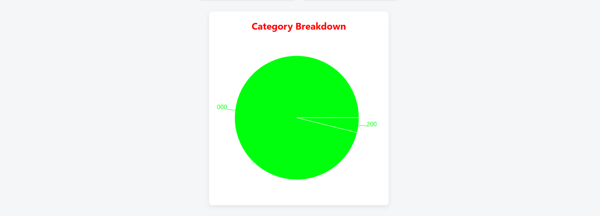

# 💰 Expense & Income Tracker

A fully-featured **Expense and Income Tracking Web App** built using **React**.  
This app helps users manage their finances, track income and expenses, and visualize spending with charts and summary cards. Data persists in the browser using LocalStorage.

---

## ✨ Features

- ➕ Add income and expense transactions
- ✏️ Edit existing transactions
- ❌ Delete transactions
- 📊 Category-wise analytics with dynamic charts
- 💰 Summary cards (Total Income, Total Expense, Net Balance)
- 📅 Monthly filtering of transactions
- 💾 Persistent data storage using LocalStorage
- 🧩 Reusable modal-based form UI
- 📱 Responsive design

---

## 🛠 Tech Stack

- **Frontend:** React (Functional Components & Hooks)
- **Routing:** React Router
- **State Management:** useState, useEffect
- **Charts:** Chart.js or similar
- **Storage:** Browser LocalStorage
- **Styling:** CSS

---

## 📸 Screenshots

  
  

